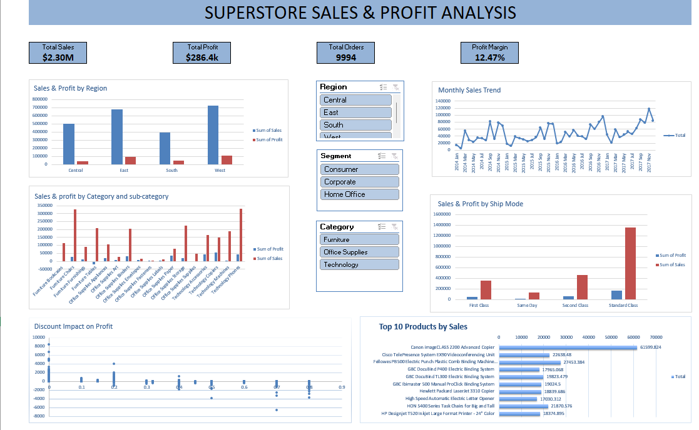

# Superstore-Sales-Profit-Analysis
## 📂 Project Files

- `Superstore_Sales_Profit_Analysis.xlsx` — Complete Excel dashboard and analysis
- `dashboard.png` — Dashboard preview

## 🚀 How to Use

1. Download `Superstore_Sales_Profit_Analysis.xlsx`.
2. Open the file in Microsoft Excel.
3. Navigate to the Dashboard sheet.
4. Use the slicers to interactively filter the analysis by Region, Category, and Segment.
5. Explore the PivotTables and charts for detailed insights.

## 📊 Dashboard Preview

## 🧰 Tools Used

- Microsoft Excel
- PivotTables
- PivotCharts
- Slicers
- XLOOKUP
- Excel formulas
- Data Cleaning & Validation
